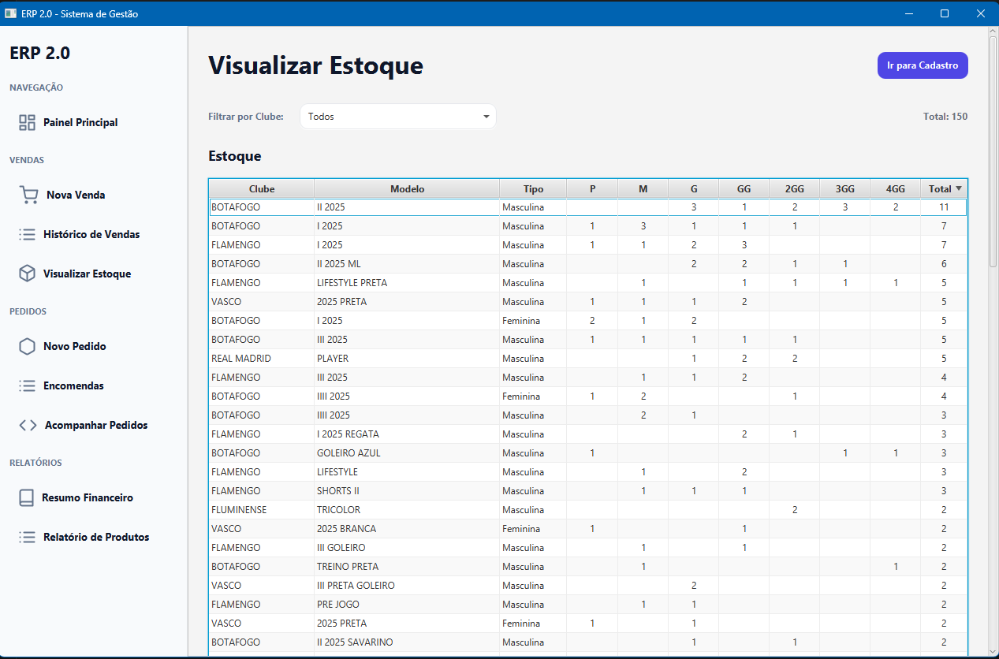
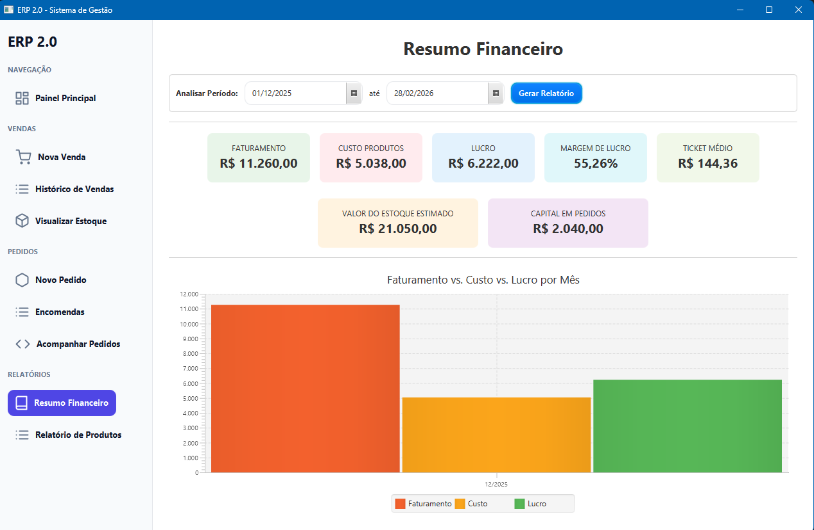

# 🛒 ERP Sports Store — Sistema de Gestão Comercial

> Sistema Desktop desenvolvido em Java para gerenciamento integral de uma loja de artigos esportivos, abrangendo desde o controle de estoque até a análise financeira.

---

## 📌 Sobre o Projeto

Este projeto teve início como parte do portfólio acadêmico do curso de **Sistemas de Informação na UFRRJ** e evoluiu para um **sistema ERP funcional**, atualmente em **uso real e contínuo** em uma loja de artigos esportivos.

A aplicação resolve problemas reais de gestão comercial, substituindo controles manuais em planilhas por um sistema centralizado, confiável e extensível. O sistema permite o controle completo de grades de produtos (tamanhos e tipos), fluxo de caixa, gestão de encomendas de clientes e pedidos a fornecedores.

### 🏠 Página Inicial do Sistema


---

## 🚀 Funcionalidades Principais

O sistema é dividido em módulos integrados, garantindo consistência dos dados e previsibilidade operacional.

### 📦 Gestão de Estoque
- Controle detalhado por **Modelo, Clube, Tipo (Masculino/Feminino/Infantil)** e **Tamanho**.
- Suporte a grade de tamanhos Adulto (P ao 4GG) e Infantil (16 ao 28).
- Visualização rápida de itens com baixo estoque.



---

### 💰 Financeiro & Vendas
- **PDV Completo:** Cálculo automático de subtotal, descontos e troco.
- **Formas de Pagamento:** Dinheiro, Pix, Cartão e vendas "Fiado" (pendente).
- **Dashboard Financeiro:** Gráficos de Faturamento vs. Custo vs. Lucro.
- Cálculo automático de Ticket Médio e Margem de Lucro.



---

### 🚚 Cadeia de Suprimentos
- **Encomendas de Clientes:** Registro e acompanhamento de pedidos específicos.
- **Pedidos a Fornecedores:** Gestão de compras para reposição de estoque.
- **Conferência de Entrada:** Validação de itens recebidos em relação aos itens pedidos.

---

### 📊 Relatórios e Business Intelligence
- Relatórios de **Clube Mais Vendido** e **Tamanho Mais Vendido**.
- Gráficos de barras para análise de performance de vendas.

---

## 🛠️ Tecnologias e Arquitetura

O projeto foi construído seguindo o padrão arquitetural **MVC (Model-View-Controller)**, garantindo separação de responsabilidades, organização do código e facilidade de manutenção.

* **Linguagem:** Java (JDK 21+ recomendado)
* **Interface Gráfica:** JavaFX (FXML para definição de layouts)
* **Banco de Dados:** MySQL (8.0+)
* **Conectividade:** JDBC puro (controle explícito de queries e transações)
* **Bibliotecas:** `mysql-connector-java`, `javafx-controls`, `javafx-fxml`

<!-- IMAGEM OPCIONAL: Diagrama simples da arquitetura ou estrutura de pacotes -->
<!-- Exemplo: images/arquitetura.png -->

### Estrutura de Pastas
- `src/erp/model` — Entidades, objetos de valor e regras de negócio
- `src/erp/view` — Interfaces gráficas (`.fxml`)
- `src/erp/controller` — Lógica de controle e interação entre View e Model
- `src/UTIL` — Classes utilitárias, incluindo conexão com banco de dados

---

## 🔧 Como Executar

### Pré-requisitos
- Java JDK 17 ou superior
- MySQL Server em execução
- JavaFX configurado na IDE ou via linha de comando

### Passo a Passo
1. **Clone o repositório**
   ```bash
   git clone https://github.com/victorhob1981/ERP-LOJAESPORTES.git
2. **Configuração do Banco**

Crie um banco de dados chamado gemini_erp (ou ajuste no arquivo ConexaoBanco.java)

Execute o script SQL disponível na pasta database/ para criação das tabelas

3. **Configuração da IDE**

Adicione o JavaFX e o Driver MySQL ao CLASSPATH ou Module Path

Ajuste as credenciais de banco em src/UTIL/ConexaoBanco.java

4. **Execução**

Execute a classe principal: src/erp/application/Main.java

👨‍💻 Autor

Victor Hugo de Oliveira Barbosa
Estudante de Sistemas de Informação — UFRRJ

Projeto desenvolvido com foco em engenharia de software, modelagem de domínio e resolução de problemas reais, buscando aplicar boas práticas de arquitetura, organização e persistência de dados.

🔗 LinkedIn: https://www.linkedin.com/in/victor-ho-barbosa

📩 Email: victorhob23@gmail.com
